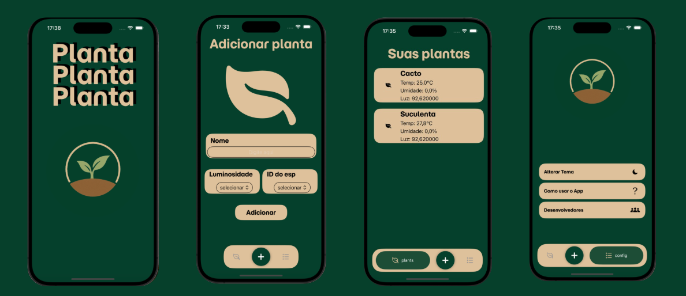
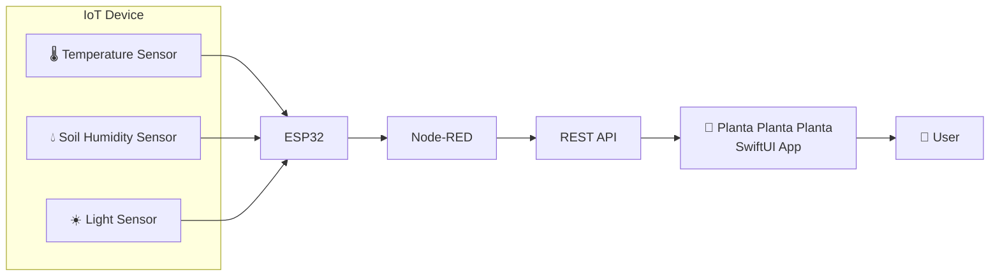

# 🌱 Planta Planta Planta

An IoT-powered mobile application that helps users monitor their plants remotely through real-time environmental data.

Developed **collaboratively** as a team during the **HackaTruck MakerSpace** program.

## 📖 Overview

This project was developed to simplify plant care by integrating IoT devices with a mobile application. Environmental data collected by sensors is transmitted to an ESP32, processed by Node-RED, and delivered to an iOS application through a REST API.

The application allows users to register plants, associate them with IoT devices, and monitor environmental conditions such as temperature, light intensity, and soil humidity in real time.

---

## ✨ Features

- Register new plants
- Associate plants with IoT devices
- Real-time monitoring
- Temperature visualization
- Soil humidity visualization
- Light intensity visualization
- Clean and intuitive interface
- Automatic data retrieval from the server

---

## 📱 Application Screens

  

---

## 🛠️ Tech Stack

### Mobile
- Swift
- SwiftUI

### IoT
- ESP32
- Environmental sensors

### Backend
- Node-RED
- REST API
- JSON

### Development Tools
- Xcode
- Git
- GitHub

---

## 🏗 System Architecture

---
## 💡 Challenges

One of the main challenges during the development was integrating hardware and software components into a single ecosystem. The project required communication between embedded devices, Node-RED flows, REST APIs, and the SwiftUI application, demanding constant testing and integration across different technologies.

---

## 👥 Team Contributions

This project was developed collaboratively as part of the HackaTruck MakerSpace program. Each team member contributed to different parts of the application and system.

### Maria Clara Paterno Maia - Front-end & Backend
- Developed the "My Plants" screen using SwiftUI
- Designed and implemented the application's custom tab bar
- Contributed to the backend and IoT integration
- Worked on the communication between the ESP32 and the REST API
- Assisted with testing and troubleshooting sensor data transmission from the ESP32 to the API
- Contributed to the integration between the mobile application, backend, and IoT components

### Enzo Sá - Front-end
### Gabriel Oliveira - Backend
### Mário Bernardo - Front-end
### Sérgio de Paiva - Front-end
- Developed the app's Settings screen
- Implemented the Credits (Developers) screen
- Created the "How to Use the App" screen
- Implemented the theme toggle functionality (light/dark mode)

---

## 📚 What we Learned

Throughout this project we gained practical experience with:

- SwiftUI development
- REST API integration
- JSON parsing
- Node-RED flows
- IoT architecture
- Hardware and software integration
- Collaborative software development
- Git version control

---

## 🚀 Future Improvements

- Push notifications for abnormal conditions
- Historical sensor data
- Data visualization charts
- Plant care recommendations
- AI-powered irrigation suggestions
- User authentication
- Cloud database integration
