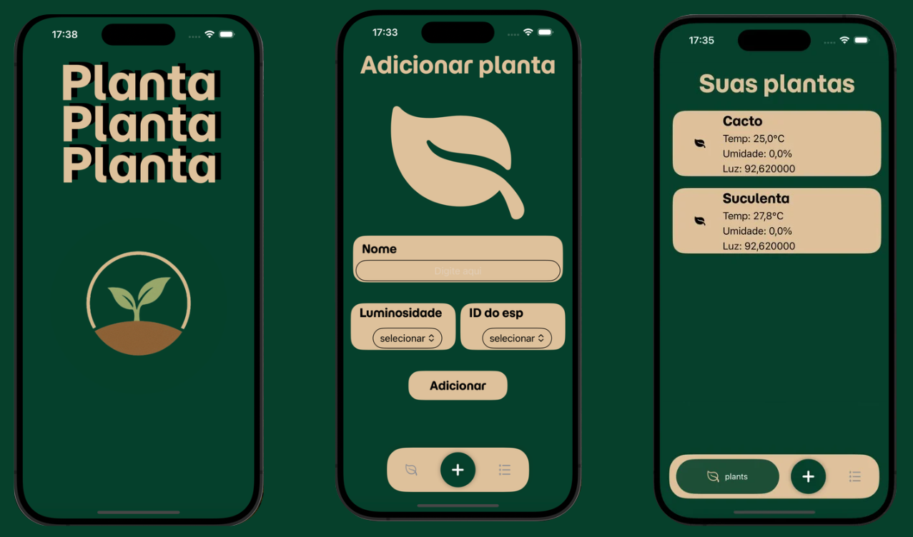
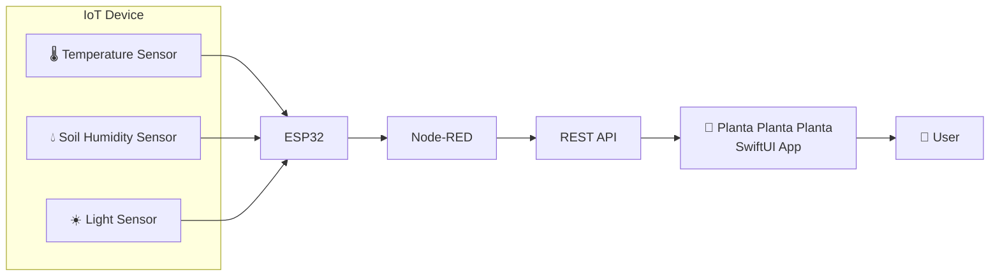

# 🌱 Planta Planta Planta

An IoT-powered mobile application that helps users monitor their plants remotely through real-time environmental data.

Developed during the **HackaTruck MakerSpace** program.

## 📖 Overview

This project was developed to simplify plant care by integrating IoT devices with a mobile application. Environmental data collected by sensors is transmitted to an ESP32, processed by Node-RED, and delivered to an iOS application through a REST API.

The application allows users to register plants, associate them with IoT devices, and monitor environmental conditions such as temperature, light intensity, and soil humidity in real time.

---

## ✨ Features

- Register new plants
- Associate plants with IoT devices
- Real-time monitoring
- Temperature visualization
- Soil humidity visualization
- Light intensity visualization
- Clean and intuitive interface
- Automatic data retrieval from the server

---

## 📱 Application Screens

## 📱 Application Screens

  

<b>Home</b> &nbsp;&nbsp;&nbsp;&nbsp;&nbsp;&nbsp;&nbsp;&nbsp;
<b>Add Plant</b> &nbsp;&nbsp;&nbsp;&nbsp;&nbsp;&nbsp;&nbsp;&nbsp;
<b>Plants List</b>

---

## 🛠️ Tech Stack

### Mobile
- Swift
- SwiftUI

### IoT
- ESP32
- Environmental sensors

### Backend
- Node-RED
- REST API
- JSON

### Development Tools
- Xcode
- Git
- GitHub

---

## 🏗 System Architecture

---
## 💡 Challenges

One of the main challenges during the development was integrating hardware and software components into a single ecosystem. The project required communication between embedded devices, Node-RED flows, REST APIs, and the SwiftUI application, demanding constant testing and integration across different technologies.

---

## 📚 What I Learned

Throughout this project I gained practical experience with:

- SwiftUI development
- REST API integration
- JSON parsing
- Node-RED flows
- IoT architecture
- Hardware and software integration
- Team collaboration
- Git version control

---

## 🚀 Future Improvements

- Push notifications for abnormal conditions
- Historical sensor data
- Data visualization charts
- Plant care recommendations
- AI-powered irrigation suggestions
- User authentication
- Cloud database integration

---

## 🔗 Contact information 
- 💼 LinkedIn: https://www.linkedin.com/in/maria-clara-paterno-maia-9450b73aa
- 🐙 e-mail: mclara.paterno@gmail.com
